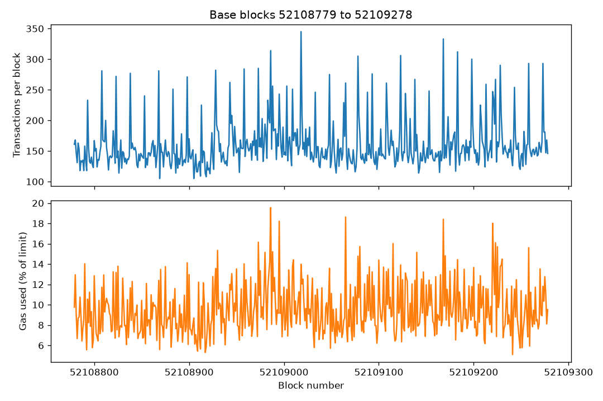

# Block sample analysis: 500 Base blocks

Run date: 2026-10-03

Data: `data/blocks-500.csv` (made by `scripts/export_blocks.py`)

Range: blocks 52108779 to 52109278, from 05:55:05 to 06:11:43 UTC (about 16.6 minutes)

Compare with the first sample: `blocks-sample-2026-09-30.md`

| Metric | Value |
|---|---|
| Blocks | 500 |
| Average block interval | 2.00 s |
| Transactions in total | 79,758 |
| Transactions per block | 160 average, 148 median (min 105, max 345) |
| Transactions per block, 90th / 99th percentile | 206 / 306 |
| Throughput | about 80 transactions per second |
| Gas used vs. limit | 9.6% average, 5.1% minimum, 19.5% maximum |
| Gas limit | 400,000,000 in every block |
| Base fee | 5,000,000 wei (0.005 gwei) in every block |

## Chart

## Observations
- Blocks were produced at an exact 2 second cadence for the whole window.
- Blocks were never more than about a fifth full, so there was no fee pressure and the base fee stayed at its minimum.
- Transactions per block fluctuate between about 105 and 345, with sharp spikes of up to twice the median that repeat throughout the window. The cause of the spikes is not known.
- Compared with the first sample (2026-09-30, 100 blocks), throughput was lower: about 80 tx/s versus about 103 tx/s, and average gas use was 9.6% versus 11%.

## Limitations
- One window of about 17 minutes at one time of day, not a daily average.
- The numbers count all transactions, including automated ones.
- The two samples were taken at different times of day, so the difference between them may reflect normal daily variation.

## Next questions
- How do throughput and base fee change over a full day?
- What causes the repeating spikes in transactions per block?